## Code for VIP modified

### Structure of the code

We have two setups for the model: one that makes use of BNNs to model the implicit prior distribution, and another that uses Neural Samplers to do so. The BNN-based can be found in [VIIP-BNN_prior](VIIP-BNN_prior), and the NS-based on [VIIP-NS_prior](VIIP-NS_prior). For each of them, the structure of the code goes as follows: 

* **AIP_**(·)**.py**: Main body of the code. Includes calls to other functions to make the calculations needed in the model.

* **aux_functions.py**: Create auxiliary functions that estimate moments from given samples of functions evaluated at selected points (mean, deviation and covariance between two collections of samples).

* **prior_BNN.py** or **prior_neural_sampler.py**: Creates the prior samples of functions. Weight parameters (means and variances) are created and imported into the main NN. This, given an input (x), outputs f_S(x) according to the prior, which can be parametrized either as a BNN or a NS, depending on the selected folder. 

* **disc_NNs.py**: Creates and computes the output of both discriminators now needed in the procedure (since now both the approximating distribution and the prior are defined implicitly). There is a discriminator for each distribution samples (prior <em>p(·)</em> and approximating distribution <em>q(·)</em>).

* **posterior_neural_sampler.py**: Creates the NS that will output samples from the approximating distribution. Using gaussian noise as input and processing it through a NN, samples of (u) are given (with shape defined through the calling of the function). The posterior is the same for both models implemented.

* <em>**prints**</em>: This folder contains the prints of the training run of test.py

**To run the code, do:** python AIP_main.py [split] [alpha value] [n_layers (1 or 2)] composite_data.txt

The rest of the codes included here, and additional folders that may appear are just auxiliary and extra material that aid to develop the main code, on which it is based on. 

### Examples with synthetic data:

See the changes in behavior for the predictive distributions between low and high values of alpha. Better figures (pdf) can be seen in [plots_bnn](plots_bnn) or [plots_ns](plots_ns) for each dataset and each value of alpha.

The results shown here for the NS are obtained by training 2000 epochs (the same as in BNNs), but taking 1000 samples in train and 5000 in test (as opposed to the 10 samples in train and 500 in test that are used in the prior-BNN case). The images are heavy due to the number of samples plotted (1K in the case of NS, 500 for BNNs).  

#### Heterocedastic data (BNN)

#### Heterocedastic data (NS)
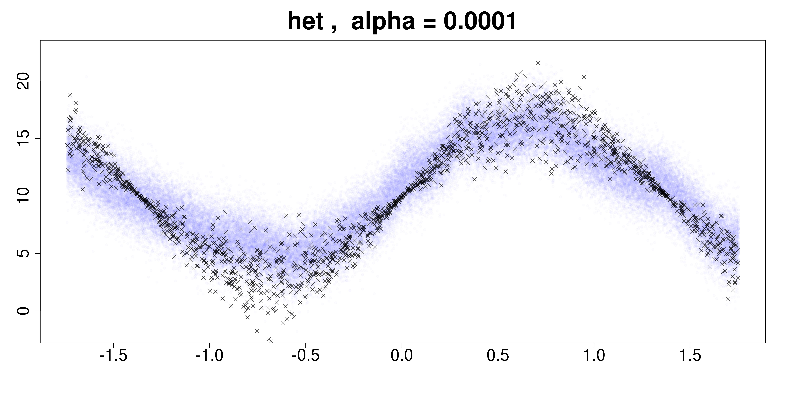
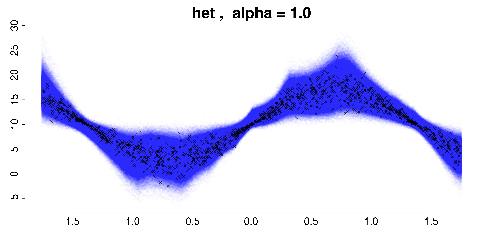

#### Bimodal data (BNN)

#### Bimodal data (NS)
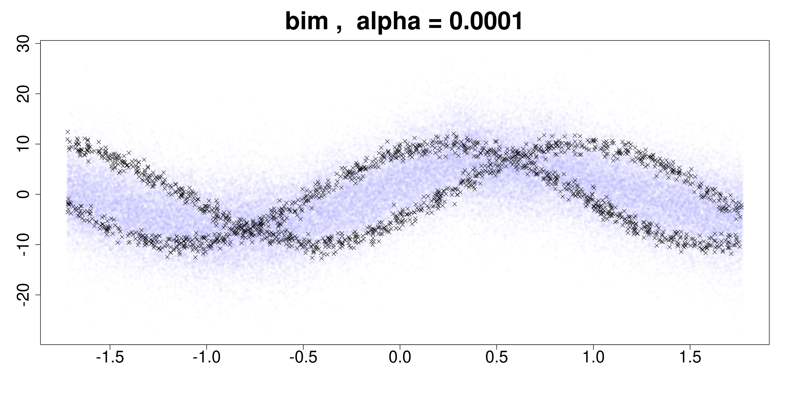
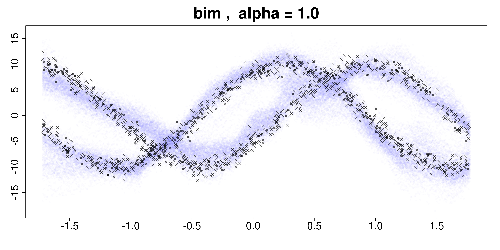

#### Composite data (BNN)

#### Composite data (NS)
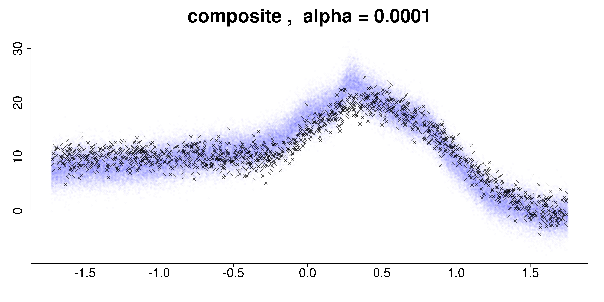
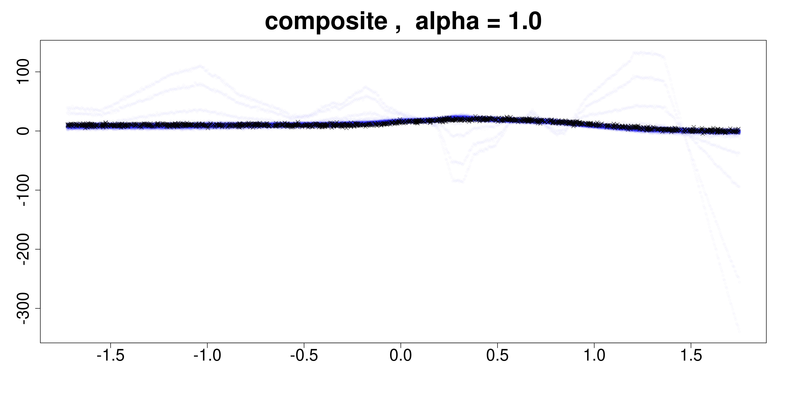

#### T-distributed data (BNN)

#### T-distributed data (NS)
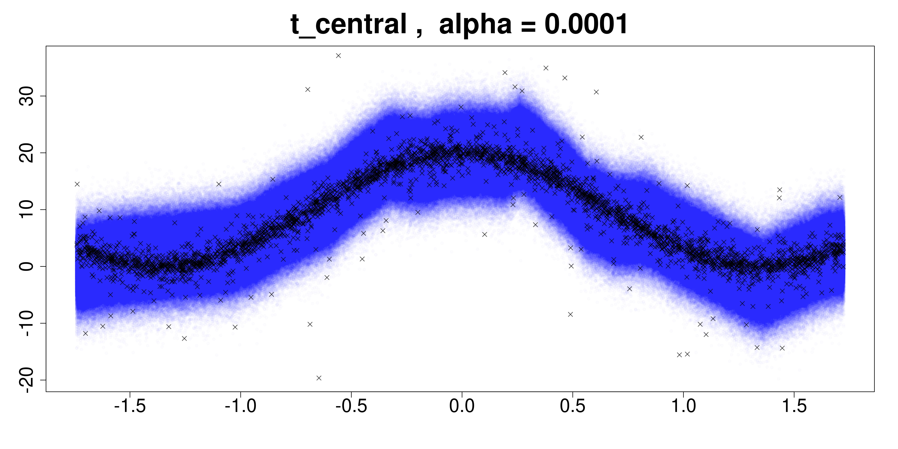
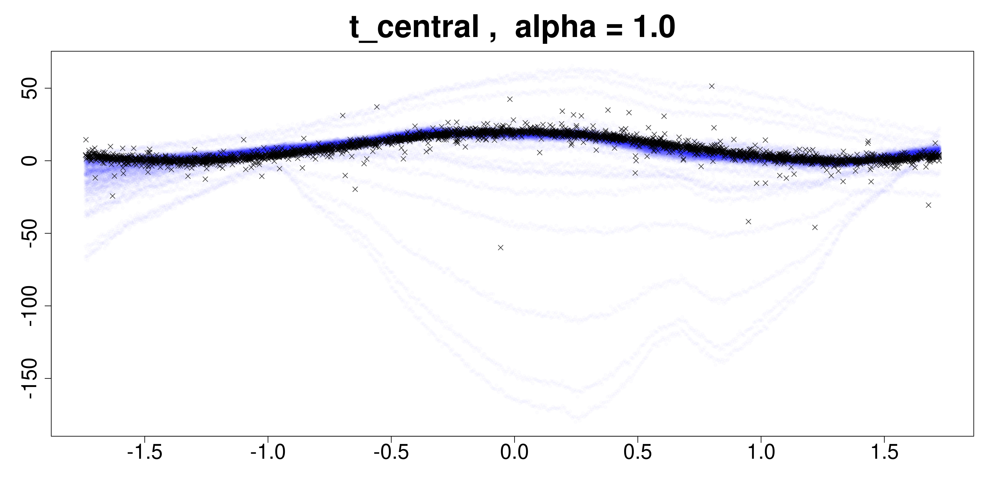

#### T-distributed and skewed data (BNN)

#### T-distributed and skewed data (NS)
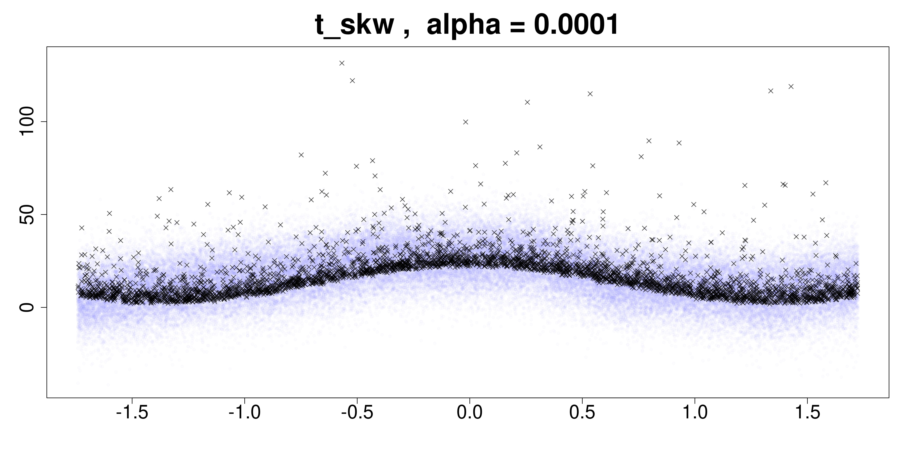
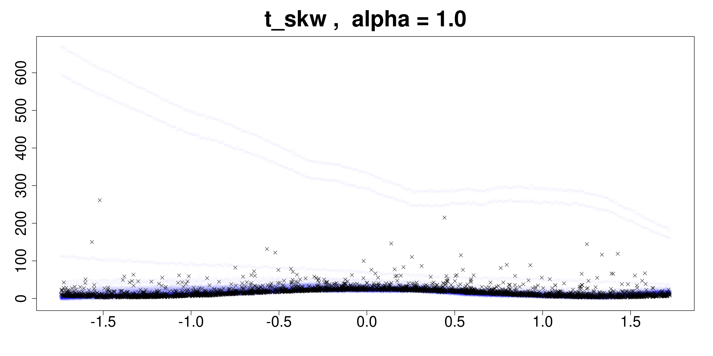

## Evolution of the positions of the inducing points by epochs

**From this point forward, the analysis has only been done for BNNs thus far** 

Here we can see the changes in the position for the inducing points during the training. The above plot (**A**) includes the final test results (showcased in blue) and the test values employed to evaluate the metrics (black points). The mean of the test samples for the predictions is represented with the blue line. In the plot below (**B**) we see the changes of the positions of the 50 induced points we have employed, being the x-axis their locations and the y-axis the epoch. We do this analysis for the three synthetic datasets.

**COMPOSITE DATA**
When we use a composite dataset on which the first half is a constant and the second is a sine function, the IPs tend to group up in the place of the contact between the two different functions (x = -0.5) (the whole function is continous, although not the first derivative)

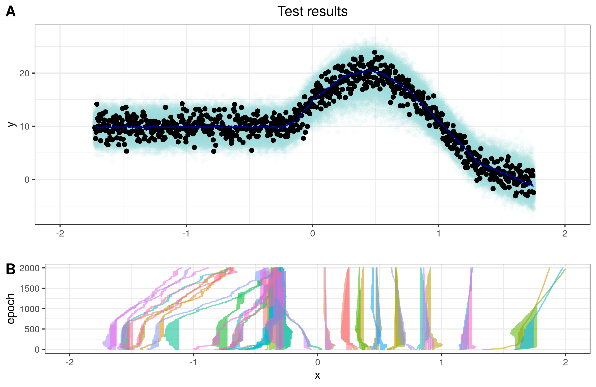

**HETEROCEDASTIC DATA**
The shape of the samples of the initial prior implicit distribution can be tailored to specific means. The final results here seem to indicate that some structure of the initial prior affect the way on which the predictions behave as well, as can be seen here. The initial prior consisted on very "straight"-like functions, and thus we can observe a somewhat straight lines pattern in the predictive intervals. This is being researched further. 

**BIMODAL DATA**
As before, strong preferences in location for the implicit points cannot be seen neither here or in the heterocedastic case. 

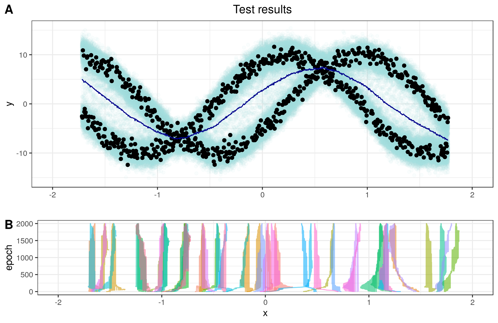

The shape of the prior can be exploited here, which remains to be carefully looked at. 

### The prior can be updated to end up being sensible to the data observed

**The prior analysis for the NS is done also - the results are in the plots folder**

The prior information contained, although important to the final prediction results, can be updated to reflect the data observed. As can be seen here, the prior functions sampled (in the first image) acquire a shape more similar to that of the observed points. Here the heterocedastic data is being used, the same as before (thus, it has a sinusoidal shape, which becomes apparent in the latter prior samples).

**Initial samples from the implicit prior (before training)**

**Final sample functions from the prior (after training)**

