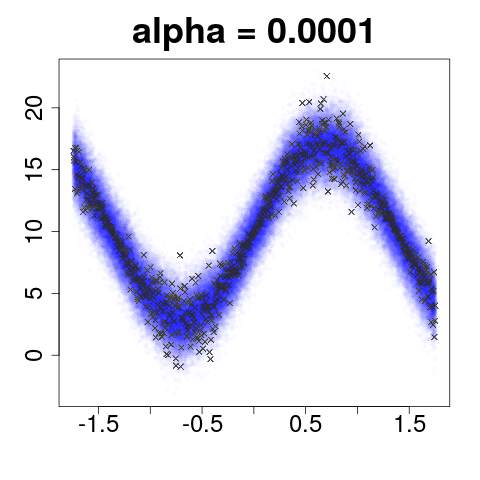
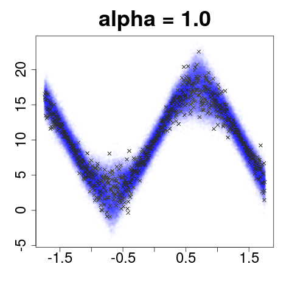
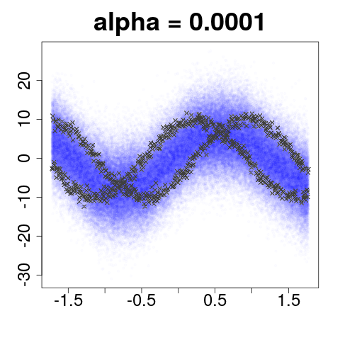
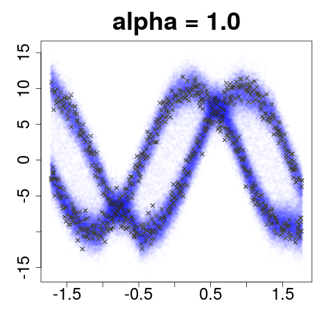
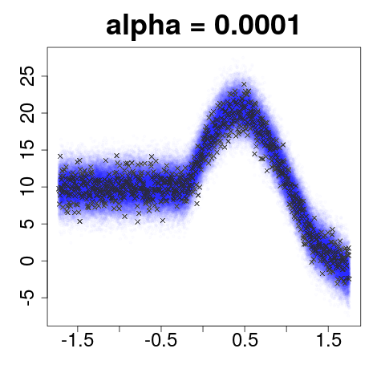
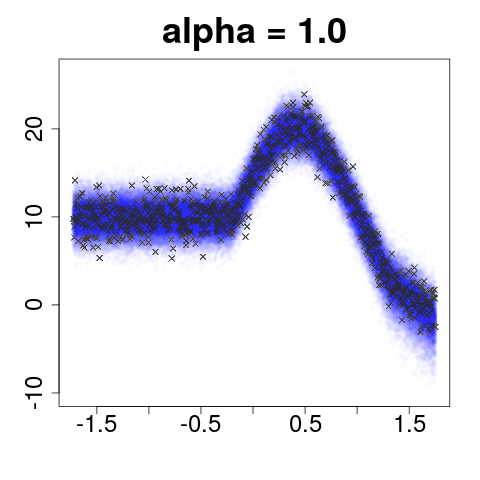
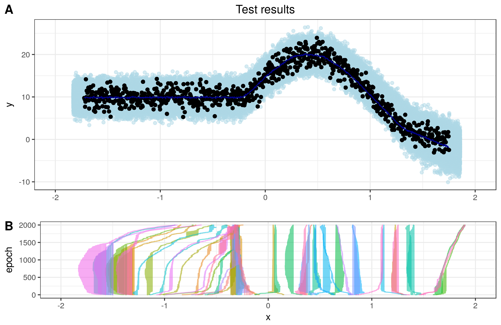
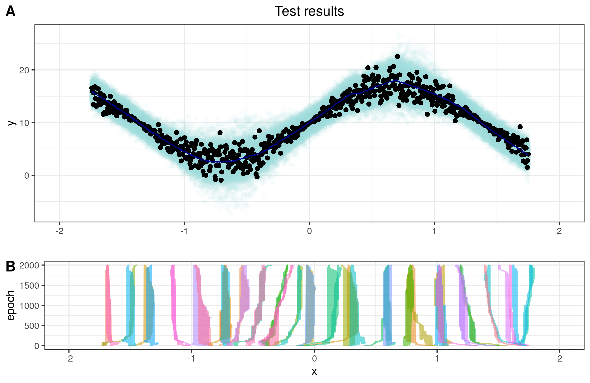
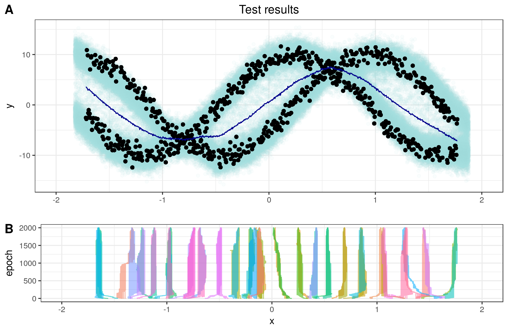
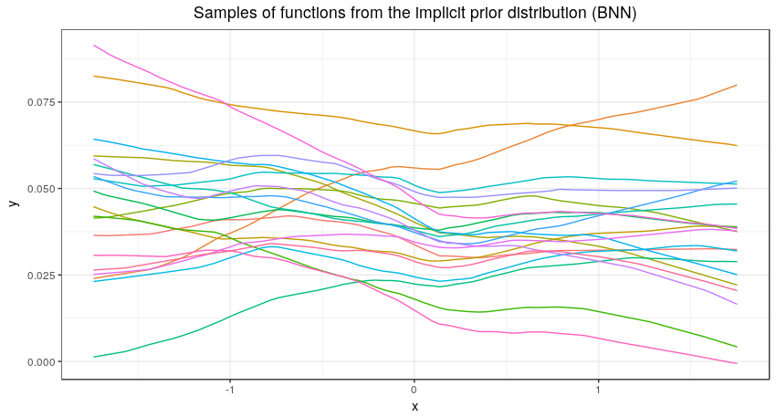

### Code for VIP modified

#### Structure of the code

* **AIP_main.py**: Main body of the code. Includes calls to other functions to make the calculations needed in the model.

* **aux_functions.py**: Create auxiliary functions that estimate moments from given samples of functions evaluated at selected points (mean, deviation and covariance between two collections of samples).

* **BNN_prior.py**: Creates the BNN that samples values from prior on functions. Weight parameters (means and variances) are created and imported into the main NN. This, given an input (x), outputs f_S(x) according to the prior.

* **disc_NNs.py**: Creates and computes the output of both discriminators now needed in the procedure (since now both the approximating distribution and the prior are defined implicitly). There is a discriminator for each distribution samples (prior <em>p(·)</em> and approximating distribution <em>q(·)</em>).

* **neural_sampler.py**: Creates the NS that will output samples from the approximating distribution. Using gaussian noise as input and processing it through a NN, samples of (u) are given (with shape defined through the calling of the function)

* <em>**prints**</em>: This folder contains the prints of the training run of test.py

**To run the code, do:** python AIP_main.py [split] [alpha value] [n_layers (1 or 2)] composite_data.txt

The rest of the codes included here, and additional folders that may appear are just auxiliary and extra material that aid to develop the main code, on which it is based on. 

### EXAMPLE OF SYNTHETIC DATASET:

See the changes in behavior for the predictive distributions between low and high values of alpha. Better figures (pdf) can be seen in the folder of <em>plot_results</em> for each dataset and each value of alpha.

#### Heterocedastic data

#### Bimodal data

#### Composite data

## Evolution of the positions of the inducing points by epochs

Here we can see the changes in the position for the inducing points during the training. The above plot (**A**) includes the final test results (showcased in blue) and the test values employed to evaluate the metrics (black points). The mean of the test samples for the predictions is represented with the blue line. In the plot below (**B**) we see the changes of the positions of the 50 induced points we have employed, being the x-axis their locations and the y-axis the epoch. We do this analysis for the three synthetic datasets.

**COMPOSITE DATA**
When we use a composite dataset on which the first half is a constant and the second is a sine function, the IPs tend to group up in the place of the contact between the two different functions (x = -0.5)

**HETEROCEDASTIC DATA**

**BIMODAL DATA**

* **Puede aprovecharse lo de que se herede la forma del prior, hay que hacer pruebas al respecto**

#### Function samples from the prior depending on the initial values of the variances

Both of the results shown below are obtained in an identical fashion: the code is exactly the same for both of them with the exception of a change in the initial seed value. Only changing this makes it so that the behaviour of the initially sampled functions f(x) from the prior <em>p(·)</em> is different enough to allow for sign and other widespread changes. Biases are deterministic

**Here the samples are shown to be all positive, but that depends on the initial seed of the code (seed = 123)** 

**Samples in the case of negative values (seed = 555)**

