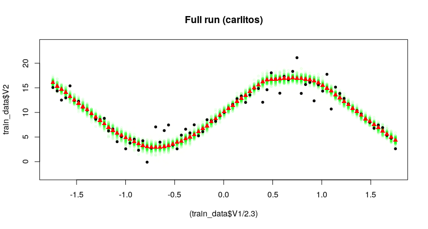
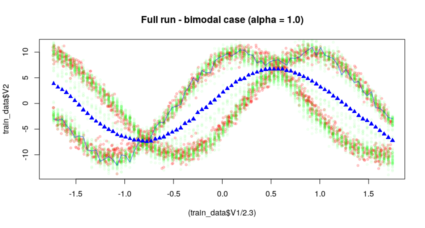
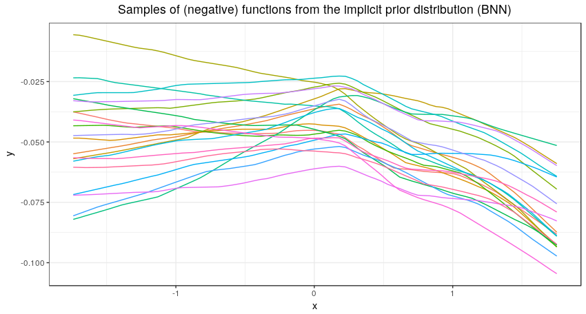

### Code for VIP modified

#### Structure of the code

* **test_code.py**: Main body of the code. Includes calls to other functions to make the calculations needed in the model.

* **aux_functions.py**: Create auxiliary functions that estimate moments from given samples of functions evaluated at selected points (mean, deviation and covariance between two collections of samples).

* **BNN_prior.py**: Creates the BNN that samples values from prior on functions. Weight parameters (means and variances) are created and imported into the main NN. This, given an input (x), outputs f_S(x) according to the prior.

* **disc_NNs.py**: Creates and computes the output of both discriminators now needed in the procedure (since now both the approximating distribution and the prior are defined implicitly). There is a discriminator for each distribution samples (prior <em>p(·)</em> and approximating distribution <em>q(·)</em>).

* **neural_sampler.py**: Creates the NS that will output samples from the approximating distribution. Using gaussian noise as input and processing it through a NN, samples of (u) are given (with shape defined through the calling of the function)

* <em>**prints**</em>: This folder contains the prints of the training run of test.py

**To run the code, do:** python test_code.py [split] [alpha value] [n_layers (1 or 2)] boston_housing.txt

The rest of the codes included here, and additional folders that may appear are just auxiliary and extra material that aid to develop the main code, on which it is based on. 

### EXAMPLE OF SYNTHETIC DATASET:

This shows that the method is not learning properly. On black we have the real data, on red the estimates of the method, whose means are represented as green crosses (for each x_test given). 

#### Results sampling the weights instead of the activations (100 epochs, alpha = 1.0)

#### Results sampling the activations (epoch = 27, Cholesky decomposition falls apart afterwards)

#### BIMODAL CASE: Results sampling the weights instead of the activations (100 epochs, alpha = 1.0)

#### Function samples from the prior depending on the initial values of the variances

Both of the results shown below are obtained in an identical fashion: the code is exactly the same for both of them with the exception of a change in the initial seed value. Only changing this makes it so that the behaviour of the initially sampled functions f(x) from the prior <em>p(·)</em> is different enough to allow for sign and other widespread changes. 

**Here the samples are shown to be all positive, but that depends on the initial seed of the code (seed = 123)** 

**Samples in the case of negative values (seed = 555)**

